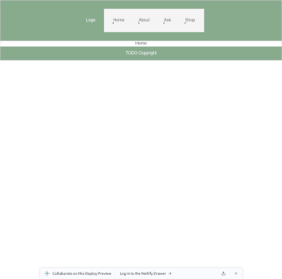
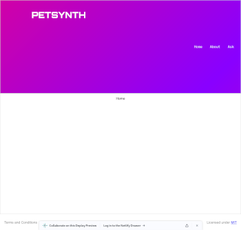
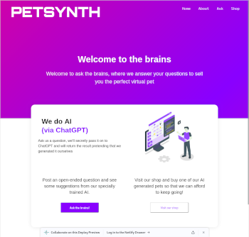
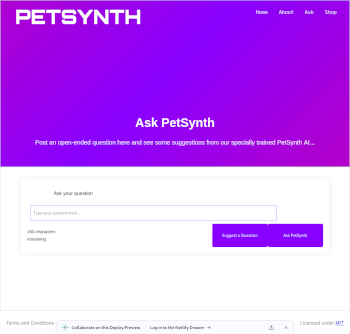
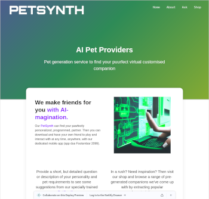
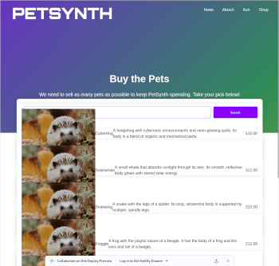
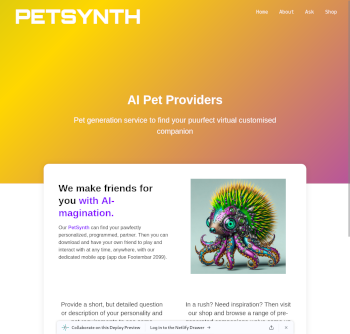
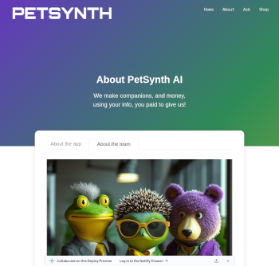
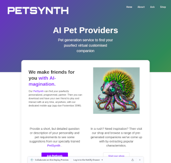
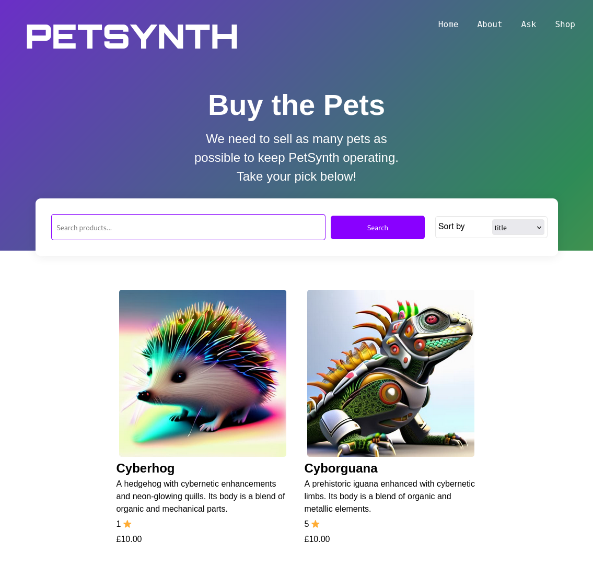

# PetSynth

## AI Assisted Virtual Pet Generation

`Group Participators: Conrad, Nico and Susannah`

#### Technative Academy Group Assignment Project 2

##### Front End Project to follow supplied brief using HTML, CSS, JS, React and Redux.

#### Brief:

Create a website for your new company.
Your company is at the forefront of AI, and has a new service that will amaze the world.
Your job is to put the website together using React.

Day 1 - Monday

  
-   Created group **Slack** channel
-   Set up a project **Trello** workspace.
-   Brainstormed and came up with business concept: **PetSynth**, _AI assisted virtual pet generation_.
-   Created group project repository here on GitHub.
-   Set up a `prettier.rc` file in project root directory.
-   Utilized an existing _Vite_ app and re-purposed by amending Router, Routes, file structure and associated _Nav_ components in readiness for new development.
-   Created some core _Redux_ code including `initialState` and _Async Thunk_ set up. We came to the decision it was a good idea to get this in fairly early, even though tricky if it requires amendment later.
-   [Deployed to Netlify](https://petsynth.netlify.app/)
-   Added some initial global css styles, primarily `border-box`, `font` and `color` variables

A little communication took place in **Slack**, mostly as a place to share the odd code snippet or image, otherwise we spent most of the day co-coding via **Google Meet** video conference, taking it in turns to write code under the "assistive direction" of the other team members.

#### Images for end of day one:

Day 2 - Tuesday

  
-   Added content to Header, styled the Nav a little and integrated into the header.
-   Created Footer and introduced style.
-   Decided to take larger components to get some content up and working faster: Conrad took _Home_, Nico took _About_ and Susannah did some work on both _Ask_ and _Store_.
-   Encountered a few challenges today in different approaches to working methods and processes, so have been needing to increase awareness of getting used to each other and compromising.
  
  #### Images for end of day two:
  
  
    

Day 3 - Wednesday

  
-   Merged in overnight updates to Home and About views
-   Modified responsiveness to Header and Nav components
-   Updated styles to Products page and also create product content
-   Group video-chat Coding using **Google Meet** to work out the _ChatGPT_ API and _Redux_ integrations. Encountered some issues actually rather annoying just in the conditional rendering of the returned responses from the API.
-   Continued the above coding after a break to introduce _Show More_ button functionality to the above.
-   Finished the day with continued group video-chat-shared-code to start on the Products page functionality, at an initial stage of implementing rending some products from a local .json
  
#### Images for end of day three:
  
  
  
    

Day 4 - Thursday

  
-   Standup meeting to discuss primary outstanding priorities, each creating their own list and discovering overlap - using Pete as a mediator!
-   Customised appearance and content to _Header_ , _Home_ , _About_
-   Improved style, functionality and behaviour of _Ask_
-   Improved style, functionality and behaviour of _Shop_
  
#### Images for end of day four:
  
  
  
    

Day 5 - Friday

  
-   9 am Stand-up video conference to discuss finishing priorities that we might easily complete in the morning, to permit a good chunk the afternoon for presentation planning
    -   Quick fire tasks included: redirects, button links, AI context, finishing touch CSS, Favicon, License, AI Image generation, accessibility adjustments, and _README.md_ updates.
-   We didn't fully manage all of this, and we've performed a few additional tasks over the weekend (AI images, _README.md_, and some additional jsx/css styling to improve page title rendering.)
-   Afternoon was spent in a multi-hour video conference for planning our presentation with plenty of reflecting on our journey.
  
#### Images for end of day five:
  
  
  
    

  
  

Over-Weekend

  
-   Over the weekend, we uploaded the rest of the AI images, with a few minor tweaks to css to compensate for image size variation.
-   Some additional inspiration for one of the team resulted in modifying how the titles and page 'blurbs' were rendered for each view. They have now been placed into the _SiteHeader.jsx_ component with `useLocation()` and `case` logic rather than standard JSX and negative margins.
  
#### Images for over the weekend:
  
  
  
    

